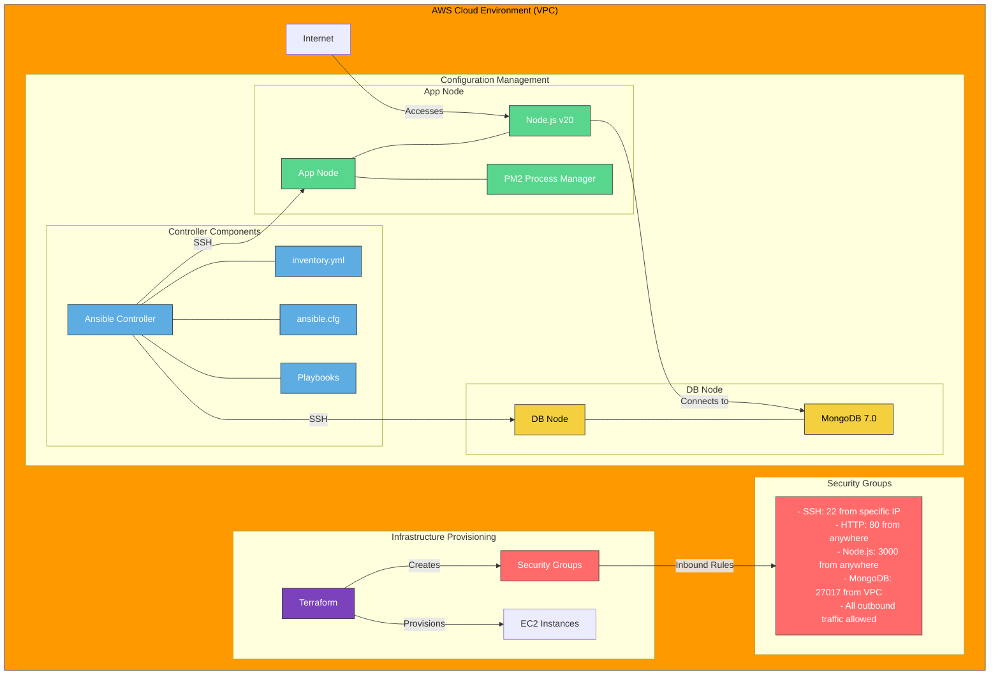

# DevOps Project: Ansible for 2-Tier App Deployment
## A Beginner-Friendly Guide

## Overview

This project demonstrates how to use Infrastructure as Code (IaC) and Configuration Management to deploy a two-tier application on AWS. We use:
- **Terraform** for infrastructure provisioning (creating virtual servers and security rules)
- **Ansible** for configuration management (installing and configuring software)
- **Node.js v20** for the application tier (the website/app users interact with)
- **MongoDB v7.0** for the database tier (where data is stored)

### What This Means for Beginners

This is a guide to automatically set up a complete web application with:
- **Two-tier application**: An application split into two main parts - the front-end (what users interact with) and the back-end (where data is stored)
- **Infrastructure as Code (IaC)**: Writing code to automatically set up computers and networks instead of doing it manually
- **Configuration Management**: Automating the setup and maintenance of software on computers

Think of it as a recipe for creating a fully functioning website that stores data, but instead of doing everything manually, special tools do most of the work automatically.

## Architecture



### Architecture Explained for Beginners

This diagram shows how everything connects in our project. Let's break it down step by step:

#### 1. AWS Cloud Environment (Yellow)
- This is like renting space in a digital data center where our computers will live
- AWS (Amazon Web Services) provides virtual computers that run in their data centers

#### 2. Terraform for Infrastructure (Purple)
- **What it does**: Creates virtual computers and sets up security rules
- **How it works**: We write code that tells AWS what to create
- **Why it's useful**: We can create identical setups repeatedly without manual work

#### 3. Security Groups (Red)
- **What they are**: Virtual firewalls that control who can access our computers
- **How they work**: They have rules that say which types of connections are allowed
- **Why they're important**: They keep our application secure from unauthorized access

#### 4. Ansible Controller (Blue)
- **What it is**: A computer that manages the setup of other computers
- **How it works**: It connects to other computers via SSH and runs commands on them
- **Why it's useful**: It automates the installation and configuration of software

#### 5. App Node (Green)
- **What it is**: The computer that runs our website/application
- **What it runs**: 
  - Node.js: A platform for running JavaScript code on a server
  - PM2: A tool that keeps our application running even if it crashes

#### 6. Database Node (Yellow)
- **What it is**: The computer that stores our application's data
- **What it runs**: MongoDB, a database system that stores data in a flexible, JSON-like format

#### 7. Connections
- The Ansible Controller connects to both the App Node and DB Node to set them up
- The App Node connects to the DB Node to store and retrieve data
- Users from the internet connect to the App Node to use our application

#### The Flow of Operations

1. **First**, Terraform creates the virtual computers and security rules in AWS
2. **Then**, the Ansible Controller connects to these computers
3. **Next**, Ansible installs and configures the necessary software on each computer
4. **Finally**, the application runs with Node.js talking to MongoDB for data storage

Think of it like building a house: Terraform creates the foundation and structure, while Ansible furnishes and decorates each room according to its purpose.

## Key Concepts for Beginners

Before diving into the implementation, let's understand some key concepts:

### Infrastructure as Code (IaC)
- **What it is**: Writing code to create and manage computer infrastructure
- **Traditional way**: Manually clicking through web interfaces to create servers
- **IaC way**: Writing code that automatically creates servers with exact specifications
- **Benefits**: Reproducibility, version control, consistency, and automation

### Configuration Management
- **What it is**: Automating the setup and maintenance of software on computers
- **Traditional way**: Manually installing software and editing configuration files
- **Modern way**: Using tools like Ansible to automatically install and configure software
- **Benefits**: Consistency, scalability, and reduced human error

### Two-Tier Architecture
- **What it is**: Separating an application into two main parts
- **Application tier**: Handles user interactions and business logic
- **Database tier**: Stores and manages data
- **Benefits**: Better security, easier maintenance, and improved performance

## Day 1: Infrastructure and App Node Setup

### 1. Infrastructure Provisioning with Terraform

#### EC2 Instance Creation
```hcl
# main.tf
provider "aws" {
  region = "eu-west-1"
}

data "aws_vpc" "default" {
  default = true
}

resource "aws_instance" "app_instance" {
  ami                         = var.instance_ami_id  # Ubuntu 22.04 LTS
  key_name                    = var.ssh_key_name
  instance_type               = var.instance_type    # t3.micro
  associate_public_ip_address = var.enable_public_ip
  vpc_security_group_ids      = [aws_security_group.app_sg.id]

  tags = {
    Name = var.app_instance_name
  }
}

resource "aws_instance" "db_instance" {
  ami                         = var.instance_ami_id
  key_name                    = var.ssh_key_name
  instance_type               = var.instance_type
  associate_public_ip_address = var.enable_public_ip
  vpc_security_group_ids      = [aws_security_group.app_sg.id]

  tags = {
    Name = var.db_instance_name
  }
}
```

#### Code Explanation for Beginners

This Terraform code creates our virtual computers in AWS. Let's break it down line by line:

1. `provider "aws" { region = "eu-west-1" }`:
   - This tells Terraform we're using AWS
   - We're creating our resources in the EU West (Ireland) region

2. `data "aws_vpc" "default" { default = true }`:
   - A VPC is a private network in AWS
   - This line finds the default VPC that comes with your AWS account

3. `resource "aws_instance" "app_instance" { ... }`:
   - This creates our first virtual computer (EC2 instance) for the application
   - Inside the curly braces are all the settings for this computer

4. Inside the app_instance settings:
   - `ami`: The operating system image (Ubuntu 22.04)
   - `key_name`: The SSH key used to securely connect to the instance
   - `instance_type`: The size/power of the computer (t3.micro is small and inexpensive)
   - `associate_public_ip_address`: Gives the computer a public IP address so we can access it
   - `vpc_security_group_ids`: Applies our security rules to this computer
   - `tags`: Gives the computer a name for easy identification

5. `resource "aws_instance" "db_instance" { ... }`:
   - This creates our second virtual computer for the database
   - It has the same settings as the app instance

The actual values for these settings come from variables (var.instance_ami_id, etc.) which are defined in another file called variable.tf:

```hcl
# From variable.tf
variable "app_instance_name" {
  description = "Name for the app instance"
  type        = string
  default     = "tech501-haashim-ansible-controller"
}

variable "db_instance_name" {
  description = "Name for the database instance"
  type        = string
  default     = "tech501-haashim-ansible-node-db"
}

variable "instance_type" {
  description = "The type of EC2 instance to launch"
  type        = string
  default     = "t3.micro"
}

variable "instance_ami_id" {
  description = "The AMI ID to use for the EC2 instance"
  type        = string
  default     = "ami-0c1c30571d2dae5c9"
}
```

#### Security Group Configuration
```hcl
# security-group.tf
resource "aws_security_group" "app_sg" {
  name        = var.security_group_name
  vpc_id      = data.aws_vpc.default.id

  # SSH access from specific IP
  ingress {
    description = "Allow SSH from specific IP"
    from_port   = 22
    to_port     = 22
    protocol    = var.protocol
    cidr_blocks = [var.ssh_allowed_cidr]
  }

  # Internal SSH within VPC
  ingress {
    description = "Allow internal SSH"
    from_port   = 22
    to_port     = 22
    protocol    = var.protocol
    cidr_blocks = ["172.31.0.0/16"]
  }

  # HTTP access
  ingress {
    description = "Allow HTTP"
    from_port   = 80
    to_port     = 80
    protocol    = var.protocol
    cidr_blocks = [var.public_access_cidr]
  }

  # Node.js app access
  ingress {
    description = "Allow inbound Node.js traffic"
    from_port   = 3000
    to_port     = 3000
    protocol    = var.protocol
    cidr_blocks = [var.public_access_cidr]
  }

  # MongoDB access
  ingress {
    description = "Allow MongoDB traffic"
    from_port   = 27017
    to_port     = 27017
    protocol    = var.protocol
    cidr_blocks = [var.public_access_cidr]
  }

  # All outbound traffic
  egress {
    description = "Allow all outbound traffic"
    from_port   = 0
    to_port     = 0
    protocol    = "-1"
    cidr_blocks = [var.public_access_cidr]
  }
}
```

#### Security Group Explanation for Beginners

This code creates a virtual firewall (security group) that controls who can access our computers. Think of it like setting up security guards with specific instructions:

1. `resource "aws_security_group" "app_sg" { ... }`:
   - Creates a security group named according to var.security_group_name
   - Applies it to our default VPC

2. Each `ingress` block is a rule that allows incoming traffic:
   - `from_port` and `to_port`: The range of ports to allow (when they're the same, it's just that specific port)
   - `protocol`: The type of connection (tcp is the most common)
   - `cidr_blocks`: The IP addresses allowed to connect (in CIDR notation)

3. The specific rules are:
   - **SSH access (port 22)**: Allows remote command-line access from a specific IP address (var.ssh_allowed_cidr)
   - **Internal SSH**: Allows SSH connections between computers within our VPC (172.31.0.0/16)
   - **HTTP access (port 80)**: Allows web traffic from anywhere (var.public_access_cidr is 0.0.0.0/0, which means "anywhere")
   - **Node.js access (port 3000)**: Allows access to our Node.js application from anywhere
   - **MongoDB access (port 27017)**: Allows access to our database from anywhere

4. The `egress` block allows outgoing traffic:
   - It allows all outgoing traffic to anywhere
   - `protocol = "-1"` means "all protocols"

**Security Note for Beginners**: In a production environment, you would typically restrict MongoDB access to only come from your application servers, not from anywhere on the internet. This setup is simplified for learning purposes.

### 2. Ansible Controller Setup

#### Install Ansible
```bash
# Update package list
sudo apt update

# Install dependencies
sudo apt install -y software-properties-common

# Add Ansible repository
sudo add-apt-repository --yes --update ppa:ansible/ansible

# Install Ansible
sudo apt install -y ansible
```

#### Ansible Installation Explained

These commands install Ansible on the controller machine. Let's break them down:

1. `sudo apt update`:
   - Updates the list of available software packages
   - Like checking for the latest catalog before shopping

2. `sudo apt install -y software-properties-common`:
   - Installs a package that helps manage software repositories
   - The `-y` flag automatically answers "yes" to any prompts

3. `sudo add-apt-repository --yes --update ppa:ansible/ansible`:
   - Adds the official Ansible repository to get the latest version
   - A repository is like a specialized software store
   - `ppa:ansible/ansible` is the address of the Ansible repository
   - `--yes --update` automatically confirms and updates the package list

4. `sudo apt install -y ansible`:
   - Installs Ansible itself
   - Again, `-y` automatically answers "yes" to any prompts

In our setup script (`setup_ansible.sh`), we automate this process by SSH-ing into the controller and running these commands:

```bash
# From setup_ansible.sh
ssh -i $SSH_KEY $CONTROLLER << 'EOF'
    echo "🔧 Setting up Ansible environment..."
    
    # Update package list and install Ansible
    echo "📦 Installing Ansible..."
    sudo apt update
    sudo apt install ansible -y
    check_status "Ansible installation"

    # Verify Ansible installation
    ansible --version
    check_status "Ansible version check"
    
    # ... more setup commands ...
EOF
```

#### Configure SSH Access
```bash
# Create SSH directory
mkdir -p ~/.ssh

# Set proper permissions
chmod 700 ~/.ssh

# Copy and secure private key
cp /path/to/your-key.pem ~/.ssh/
chmod 400 ~/.ssh/your-key.pem
```

#### SSH Configuration Explained

These commands set up secure access to our target machines:

1. `mkdir -p ~/.ssh`:
   - Creates a directory for SSH keys if it doesn't exist
   - The `-p` flag creates parent directories if needed
   - `~/.ssh` is the standard location for SSH keys

2. `chmod 700 ~/.ssh`:
   - Sets permissions so only you can access this directory
   - `700` means read, write, and execute permissions for the owner only

3. `cp /path/to/your-key.pem ~/.ssh/`:
   - Copies your private key to the SSH directory
   - This key is like a special password that lets you access your AWS instances

4. `chmod 400 ~/.ssh/your-key.pem`:
   - Sets permissions so only you can read this key file
   - `400` means read permission for the owner only
   - This is a security requirement for SSH keys

In our setup script, we automate this by copying the key from our local machine to the controller:

```bash
# From setup_ansible.sh
# First copy the SSH key to the controller
scp -i $SSH_KEY $SSH_KEY $CONTROLLER:~/.ssh/id_rsa
check_status "SSH key copy"

# Then set proper permissions
ssh -i $SSH_KEY $CONTROLLER << 'EOF'
    # Set proper permissions for SSH
    chmod 600 ~/.ssh/id_rsa
    chmod 700 ~/.ssh
    check_status "SSH permissions"
    
    # ... more setup commands ...
EOF
```

#### Configure Inventory
```yaml
# inventory.yml
all:
  children:
    web:
      hosts:
        ec2-app-vm:
          ansible_host: 172.31.49.242
          ansible_user: ubuntu
          ansible_ssh_private_key_file: ~/.ssh/id_rsa
    db:
      hosts:
        ec2-db-vm:
          ansible_host: 172.31.57.64
          ansible_user: ubuntu
          ansible_ssh_private_key_file: ~/.ssh/id_rsa
```

#### Inventory Explained

The inventory file tells Ansible which machines to manage and how to connect to them:

1. `all:` - This is the top-level group that includes all machines

2. `children:` - This defines subgroups of machines

3. `web:` - This is a group for our web/application servers
   - `hosts:` - The machines in this group
   - `ec2-app-vm:` - A name we give to our application server
     - `ansible_host:` - The IP address of the server
     - `ansible_user:` - The username to use when connecting (ubuntu is the default for Ubuntu AWS instances)
     - `ansible_ssh_private_key_file:` - The path to the SSH key file

4. `db:` - This is a group for our database servers
   - Similar structure to the web group, but for our database server

In our setup script, we create a simpler version of this file:

```bash
# From setup_ansible.sh
# Create inventory file
echo "📝 Creating inventory..."
cat > ~/hosts << 'HOSTS'
[app]
172.31.57.64
HOSTS
check_status "hosts file creation"
```

This creates a file called `hosts` with a simple group called `[app]` containing one server. In a real project, we would expand this to include both app and db groups.

### 3. App Node Configuration

#### Node.js Installation Playbook
```yaml
# install_nodejs.yml
---
- name: Install Node.js and PM2
  hosts: web
  become: true
  
  tasks:
    - name: Install Node.js
      apt:
        name: 
          - nodejs
          - npm
        state: present
        update_cache: yes
        
    - name: Install PM2 globally
      npm:
        name: pm2
        global: yes
```

#### Node.js Playbook Explained

This Ansible playbook installs Node.js and PM2 on our application server:

1. `---` - This marks the start of a YAML file

2. `- name: Install Node.js and PM2` - This is the name of the play (a set of tasks)

3. `hosts: web` - This tells Ansible to run this play on all machines in the "web" group

4. `become: true` - This tells Ansible to use sudo (become a superuser) for these tasks

5. `tasks:` - This begins the list of tasks to perform

6. First task:
   - `name: Install Node.js` - A description of what this task does
   - `apt:` - Use the apt module (for Ubuntu package management)
     - `name:` - The packages to install (nodejs and npm)
     - `state: present` - Ensure these packages are installed
     - `update_cache: yes` - Update the package list before installing

7. Second task:
   - `name: Install PM2 globally` - A description of what this task does
   - `npm:` - Use the npm module (Node.js package manager)
     - `name: pm2` - The package to install
     - `global: yes` - Install it globally (available to all users)

This playbook is like giving instructions to a robot:
1. Go to all computers in the "web" group
2. Become a superuser (sudo)
3. Install Node.js and npm using apt
4. Install PM2 globally using npm

#### App Deployment Playbook
```yaml
# deploy_app.yml
---
- name: Deploy Node.js Application
  hosts: web
  become: true
  
  tasks:
    - name: Copy app files
      synchronize:
        src: ~/app/
        dest: /home/ubuntu/app
      become: false
      
    - name: Install app dependencies
      npm:
        path: /home/ubuntu/app
        state: present
      become: false
      
    - name: Start app with PM2
      shell: cd /home/ubuntu/app && pm2 start app.js
      become: false
```

#### App Deployment Explained

This playbook deploys our Node.js application to the application server:

1. `- name: Deploy Node.js Application` - The name of the play

2. `hosts: web` - Run on all machines in the "web" group

3. `become: true` - Use sudo for these tasks (but note that some tasks override this)

4. First task:
   - `name: Copy app files` - A description of what this task does
   - `synchronize:` - Use the synchronize module (similar to rsync)
     - `src: ~/app/` - The source directory on the controller
     - `dest: /home/ubuntu/app` - The destination directory on the target
   - `become: false` - Don't use sudo for this task (to avoid permission issues)

5. Second task:
   - `name: Install app dependencies` - A description of what this task does
   - `npm:` - Use the npm module
     - `path: /home/ubuntu/app` - The directory containing package.json
     - `state: present` - Ensure dependencies are installed
   - `become: false` - Don't use sudo for this task

6. Third task:
   - `name: Start app with PM2` - A description of what this task does
   - `shell:` - Run a shell command
     - `cd /home/ubuntu/app && pm2 start app.js` - Change to the app directory and start the app with PM2
   - `become: false` - Don't use sudo for this task

This playbook:
1. Copies your application files from the controller to the application server
2. Installs the application's dependencies using npm
3. Starts the application using PM2 (which keeps it running even if it crashes)

## Day 2: Database Node Setup and Integration

### 1. MongoDB Installation

#### MongoDB Installation Playbook
```yaml
# install_mongodb.yml
---
- name: Install MongoDB
  hosts: db
  become: true
  
  tasks:
    - name: Import MongoDB public key
      apt_key:
        url: https://www.mongodb.org/static/pgp/server-7.0.asc
        state: present
        
    - name: Add MongoDB repository
      apt_repository:
        repo: deb [ arch=amd64,arm64 ] https://repo.mongodb.org/apt/ubuntu jammy/mongodb-org/7.0 multiverse
        state: present
        filename: mongodb-org-7.0
        
    - name: Install MongoDB
      apt:
        name: mongodb-org
        state: present
        update_cache: yes
```

#### MongoDB Installation Explained

This playbook installs MongoDB on our database server:

1. `- name: Install MongoDB` - The name of the play

2. `hosts: db` - Run on all machines in the "db" group

3. `become: true` - Use sudo for these tasks

4. First task:
   - `name: Import MongoDB public key` - A description of what this task does
   - `apt_key:` - Use the apt_key module (for managing APT package keys)
     - `url: https://www.mongodb.org/static/pgp/server-7.0.asc` - The URL of the MongoDB public key
     - `state: present` - Ensure the key is added

5. Second task:
   - `name: Add MongoDB repository` - A description of what this task does
   - `apt_repository:` - Use the apt_repository module (for managing APT repositories)
     - `repo:` - The repository to add
     - `state: present` - Ensure the repository is added
     - `filename: mongodb-org-7.0` - The name of the file to create in /etc/apt/sources.list.d/

6. Third task:
   - `name: Install MongoDB` - A description of what this task does
   - `apt:` - Use the apt module
     - `name: mongodb-org` - The package to install
     - `state: present` - Ensure it's installed
     - `update_cache: yes` - Update the package list before installing

This playbook:
1. Adds the MongoDB public key for secure package verification
2. Adds the official MongoDB repository to get the correct version
3. Installs MongoDB from that repository

It's like telling a robot:
1. Get the security key so we can verify the MongoDB software is authentic
2. Add the address of the MongoDB software store
3. Install MongoDB from that store

#### MongoDB Configuration Playbook
```yaml
# configure_mongodb.yml
---
- name: Configure MongoDB
  hosts: db
  become: true
  
  tasks:
    - name: Configure MongoDB to accept connections
      lineinfile:
        path: /etc/mongod.conf
        regexp: '  bindIp: 127.0.0.1'
        line: '  bindIp: 0.0.0.0'
        backrefs: yes
      
    - name: Start and enable MongoDB
      service:
        name: mongod
        state: started
        enabled: yes
```

#### MongoDB Configuration Explained

This playbook configures MongoDB to accept connections from other servers:

1. `- name: Configure MongoDB` - The name of the play

2. `hosts: db` - Run on all machines in the "db" group

3. `become: true` - Use sudo for these tasks

4. First task:
   - `name: Configure MongoDB to accept connections` - A description of what this task does
   - `lineinfile:` - Use the lineinfile module (for changing specific lines in files)
     - `path: /etc/mongod.conf` - The file to modify
     - `regexp: '  bindIp: 127.0.0.1'` - The line to find (MongoDB's default configuration)
     - `line: '  bindIp: 0.0.0.0'` - The line to replace it with
     - `backrefs: yes` - Preserve the indentation of the original line

5. Second task:
   - `name: Start and enable MongoDB` - A description of what this task does
   - `service:` - Use the service module (for managing system services)
     - `name: mongod` - The service to manage
     - `state: started` - Ensure the service is running
     - `enabled: yes` - Ensure the service starts automatically on boot

This playbook:
1. Modifies the MongoDB configuration file to accept connections from any IP address
2. Starts the MongoDB service and configures it to start automatically when the server boots

By default, MongoDB only accepts connections from the same computer (127.0.0.1). We change this to 0.0.0.0 so it accepts connections from our application server.

### 2. Complete Deployment Playbook

```yaml
# deploy_all.yml
---
- name: Configure MongoDB
  hosts: db
  become: true
  
  tasks:
    - name: Import MongoDB public key
      apt_key:
        url: https://www.mongodb.org/static/pgp/server-7.0.asc
        state: present
        
    - name: Add MongoDB repository
      apt_repository:
        repo: deb [ arch=amd64,arm64 ] https://repo.mongodb.org/apt/ubuntu jammy/mongodb-org/7.0 multiverse
        state: present
        filename: mongodb-org-7.0
        
    - name: Install MongoDB
      apt:
        name: mongodb-org
        state: present
        update_cache: yes
        
    - name: Configure MongoDB to accept connections
      lineinfile:
        path: /etc/mongod.conf
        regexp: '  bindIp: 127.0.0.1'
        line: '  bindIp: 0.0.0.0'
        backrefs: yes
      
    - name: Start and enable MongoDB
      service:
        name: mongod
        state: started
        enabled: yes

- name: Deploy Node.js Application
  hosts: web
  become: true
  
  vars:
    db_host: "{{ hostvars[groups['db'][0]]['ansible_host'] }}"
  
  tasks:
    - name: Install Node.js
      apt:
        name: 
          - nodejs
          - npm
        state: present
        update_cache: yes
        
    - name: Install PM2 globally
      npm:
        name: pm2
        global: yes
        
    - name: Copy app files
      synchronize:
        src: ~/app/
        dest: /home/ubuntu/app
      become: false
      
    - name: Install app dependencies
      npm:
        path: /home/ubuntu/app
        state: present
      become: false
      
    - name: Start app with PM2 and DB connection
      shell: cd /home/ubuntu/app && DB_HOST={{ db_host }} pm2 start app.js
      become: false
```

#### Complete Deployment Explained

This playbook combines all the previous steps into one file. It has two plays:

**First Play: Configure MongoDB**
- Targets the "db" group
- Installs and configures MongoDB
- Makes MongoDB accept connections from other computers
- Starts the MongoDB service

**Second Play: Deploy Node.js Application**
- Targets the "web" group
- Sets a variable `db_host` to the IP address of the first machine in the "db" group
- Installs Node.js and PM2
- Copies the application files
- Installs the application's dependencies
- Starts the application with PM2, passing the database server's IP address as an environment variable

The most interesting part is how it connects the two tiers:
```yaml
vars:
  db_host: "{{ hostvars[groups['db'][0]]['ansible_host'] }}"
```

This line:
1. Looks at all hosts in the "db" group (`groups['db']`)
2. Takes the first one (`[0]`)
3. Gets its variables (`hostvars[...]`)
4. Extracts the `ansible_host` variable (the IP address)

Then, when starting the application:
```yaml
shell: cd /home/ubuntu/app && DB_HOST={{ db_host }} pm2 start app.js
```

It sets the `DB_HOST` environment variable to the database server's IP address, so the application knows where to find the database.

This single playbook automates the entire deployment process from start to finish, connecting all the pieces together.

## Step-by-Step Implementation Guide

### Day 1: Setting Up Infrastructure and App Node

#### Step 1: Create Infrastructure with Terraform

1. **Initialize Terraform**
   ```bash
   cd /path/to/tech501-terraform/create-ec2-instance
   terraform init
   ```
   
   **What this does**: Prepares Terraform to work with AWS by downloading necessary providers
   
   **Expected output**: Success message indicating initialization complete

2. **Plan Terraform Changes**
   ```bash
   terraform plan
   ```
   
   **What this does**: Shows what resources Terraform will create without actually creating them
   
   **Expected output**: A list of resources that will be created (2 EC2 instances and 1 security group)

3. **Apply Terraform Changes**
   ```bash
   terraform apply
   ```
   
   **What this does**: Creates the actual resources in AWS
   
   **Expected output**: Success message and output showing the public IP addresses of your instances

4. **Save the IP Addresses**
   
   Make note of the IP addresses output by Terraform:
   - `app_instance_public_ip`: The public IP of your application server
   - `db_instance_public_ip`: The public IP of your database server
   
   You'll need these for the next steps.

#### Step 2: Set Up the Ansible Controller

1. **SSH into the Controller**
   ```bash
   ssh -i ~/.ssh/your-key.pem ubuntu@<app_instance_public_ip>
   ```
   
   **What this does**: Connects to your application instance, which will be your Ansible controller
   
   **Expected output**: Welcome message from Ubuntu

2. **Install Ansible**
   ```bash
   sudo apt update
   sudo apt install -y software-properties-common
   sudo add-apt-repository --yes --update ppa:ansible/ansible
   sudo apt install -y ansible
   ```
   
   **What this does**: Installs Ansible on the controller
   
   **Expected output**: Success messages for each command

3. **Verify Ansible Installation**
   ```bash
   ansible --version
   ```
   
   **What this does**: Checks that Ansible is installed correctly
   
   **Expected output**: Ansible version information

#### Step 3: Configure SSH Access

1. **Create SSH Directory**
   ```bash
   mkdir -p ~/.ssh
   chmod 700 ~/.ssh
   ```
   
   **What this does**: Creates a secure directory for SSH keys
   
   **Expected output**: No output if successful

2. **Copy Your Private Key**
   
   You need to copy your private key to the controller. From your local machine:
   ```bash
   scp -i ~/.ssh/your-key.pem ~/.ssh/your-key.pem ubuntu@<app_instance_public_ip>:~/.ssh/id_rsa
   ```
   
   **What this does**: Copies your private key to the controller
   
   **Expected output**: Confirmation that the file was transferred

3. **Set Proper Permissions**
   
   Back on the controller:
   ```bash
   chmod 600 ~/.ssh/id_rsa
   ```
   
   **What this does**: Sets the correct permissions for the SSH key
   
   **Expected output**: No output if successful

#### Step 4: Create Ansible Configuration

1. **Create ansible.cfg**
   ```bash
   cat > ~/ansible.cfg << 'CONFIG'
   [defaults]
   inventory = hosts
   remote_user = ubuntu
   private_key_file = ~/.ssh/id_rsa
   host_key_checking = False
   timeout = 30

   [ssh_connection]
   ssh_args = -o ControlMaster=auto -o ControlPersist=60s -o UserKnownHostsFile=/dev/null -o StrictHostKeyChecking=no
   CONFIG
   ```
   
   **What this does**: Creates a configuration file for Ansible
   
   **Expected output**: No output if successful

2. **Create Inventory File**
   ```bash
   cat > ~/hosts << 'HOSTS'
   [web]
   ec2-app-vm ansible_host=<app_instance_public_ip> ansible_user=ubuntu ansible_ssh_private_key_file=~/.ssh/id_rsa

   [db]
   ec2-db-vm ansible_host=<db_instance_public_ip> ansible_user=ubuntu ansible_ssh_private_key_file=~/.ssh/id_rsa
   HOSTS
   ```
   
   **What this does**: Creates an inventory file that tells Ansible about your servers
   
   **Expected output**: No output if successful

3. **Test Connectivity**
   ```bash
   ansible all -m ping
   ```
   
   **What this does**: Tests if Ansible can connect to all servers
   
   **Expected output**: Success messages for each server

#### Step 5: Install Node.js on the App Server

1. **Create the Playbook**
   ```bash
   cat > ~/install_nodejs.yml << 'PLAYBOOK'
   ---
   - name: Install Node.js and PM2
     hosts: web
     become: true
     
     tasks:
       - name: Install Node.js
         apt:
           name: 
             - nodejs
             - npm
           state: present
           update_cache: yes
           
       - name: Install PM2 globally
         npm:
           name: pm2
           global: yes
   PLAYBOOK
   ```
   
   **What this does**: Creates a playbook to install Node.js and PM2
   
   **Expected output**: No output if successful

2. **Run the Playbook**
   ```bash
   ansible-playbook install_nodejs.yml
   ```
   
   **What this does**: Runs the playbook to install Node.js and PM2 on the app server
   
   **Expected output**: Success messages for each task

#### Step 6: Deploy the Application

1. **Prepare the App Files**
   
   For this example, let's create a simple Node.js app:
   ```bash
   mkdir -p ~/app
   cat > ~/app/app.js << 'APP'
   const express = require('express');
   const app = express();
   const port = 3000;

   app.get('/', (req, res) => {
     res.send('Hello from the 2-tier app!');
   });

   app.get('/posts', (req, res) => {
     res.send('This would fetch posts from the database');
   });

   app.listen(port, () => {
     console.log(`App listening at http://localhost:${port}`);
   });
   APP
   
   cat > ~/app/package.json << 'PACKAGE'
   {
     "name": "sparta-test-app",
     "version": "1.0.0",
     "description": "A simple 2-tier app",
     "main": "app.js",
     "dependencies": {
       "express": "^4.17.1"
     }
   }
   PACKAGE
   ```
   
   **What this does**: Creates a simple Express.js application
   
   **Expected output**: No output if successful

2. **Create the Deployment Playbook**
   ```bash
   cat > ~/deploy_app.yml << 'PLAYBOOK'
   ---
   - name: Deploy Node.js Application
     hosts: web
     become: true
     
     tasks:
       - name: Copy app files
         synchronize:
           src: ~/app/
           dest: /home/ubuntu/app
         become: false
         
       - name: Install app dependencies
         npm:
           path: /home/ubuntu/app
           state: present
         become: false
         
       - name: Start app with PM2
         shell: cd /home/ubuntu/app && pm2 start app.js
         become: false
   PLAYBOOK
   ```
   
   **What this does**: Creates a playbook to deploy the application
   
   **Expected output**: No output if successful

3. **Run the Deployment Playbook**
   ```bash
   ansible-playbook deploy_app.yml
   ```
   
   **What this does**: Deploys the application to the app server
   
   **Expected output**: Success messages for each task

4. **Test the Application**
   ```bash
   curl http://<app_instance_public_ip>:3000
   ```
   
   **What this does**: Tests if the application is running
   
   **Expected output**: "Hello from the 2-tier app!"

### Day 2: Setting Up the Database and Integration

#### Step 1: Install MongoDB on the Database Server

1. **Create the MongoDB Installation Playbook**
   ```bash
   cat > ~/install_mongodb.yml << 'PLAYBOOK'
   ---
   - name: Install MongoDB
     hosts: db
     become: true
     
     tasks:
       - name: Import MongoDB public key
         apt_key:
           url: https://www.mongodb.org/static/pgp/server-7.0.asc
           state: present
           
       - name: Add MongoDB repository
         apt_repository:
           repo: deb [ arch=amd64,arm64 ] https://repo.mongodb.org/apt/ubuntu jammy/mongodb-org/7.0 multiverse
           state: present
           filename: mongodb-org-7.0
           
       - name: Install MongoDB
         apt:
           name: mongodb-org
           state: present
           update_cache: yes
   PLAYBOOK
   ```
   
   **What this does**: Creates a playbook to install MongoDB
   
   **Expected output**: No output if successful

2. **Run the MongoDB Installation Playbook**
   ```bash
   ansible-playbook install_mongodb.yml
   ```
   
   **What this does**: Installs MongoDB on the database server
   
   **Expected output**: Success messages for each task

#### Step 2: Configure MongoDB

1. **Create the MongoDB Configuration Playbook**
   ```bash
   cat > ~/configure_mongodb.yml << 'PLAYBOOK'
   ---
   - name: Configure MongoDB
     hosts: db
     become: true
     
     tasks:
       - name: Configure MongoDB to accept connections
         lineinfile:
           path: /etc/mongod.conf
           regexp: '  bindIp: 127.0.0.1'
           line: '  bindIp: 0.0.0.0'
           backrefs: yes
         
       - name: Start and enable MongoDB
         service:
           name: mongod
           state: started
           enabled: yes
   PLAYBOOK
   ```
   
   **What this does**: Creates a playbook to configure MongoDB
   
   **Expected output**: No output if successful

2. **Run the MongoDB Configuration Playbook**
   ```bash
   ansible-playbook configure_mongodb.yml
   ```
   
   **What this does**: Configures MongoDB to accept connections from other servers
   
   **Expected output**: Success messages for each task

3. **Verify MongoDB is Running**
   ```bash
   ansible db -m shell -a "systemctl status mongod" --become
   ```
   
   **What this does**: Checks if MongoDB is running
   
   **Expected output**: Active (running) status

#### Step 3: Create the Complete Deployment Playbook

1. **Create the Complete Deployment Playbook**
   ```bash
   cat > ~/deploy_all.yml << 'PLAYBOOK'
   ---
   - name: Configure MongoDB
     hosts: db
     become: true
     
     tasks:
       - name: Import MongoDB public key
         apt_key:
           url: https://www.mongodb.org/static/pgp/server-7.0.asc
           state: present
           
       - name: Add MongoDB repository
         apt_repository:
           repo: deb [ arch=amd64,arm64 ] https://repo.mongodb.org/apt/ubuntu jammy/mongodb-org/7.0 multiverse
           state: present
           filename: mongodb-org-7.0
           
       - name: Install MongoDB
         apt:
           name: mongodb-org
           state: present
           update_cache: yes
           
       - name: Configure MongoDB to accept connections
         lineinfile:
           path: /etc/mongod.conf
           regexp: '  bindIp: 127.0.0.1'
           line: '  bindIp: 0.0.0.0'
           backrefs: yes
         
       - name: Start and enable MongoDB
         service:
           name: mongod
           state: started
           enabled: yes

   - name: Deploy Node.js Application
     hosts: web
     become: true
     
     vars:
       db_host: "{{ hostvars[groups['db'][0]]['ansible_host'] }}"
     
     tasks:
       - name: Install Node.js
         apt:
           name: 
             - nodejs
             - npm
           state: present
           update_cache: yes
           
       - name: Install PM2 globally
         npm:
           name: pm2
           global: yes
           
       - name: Copy app files
         synchronize:
           src: ~/app/
           dest: /home/ubuntu/app
         become: false
         
       - name: Install app dependencies
         npm:
           path: /home/ubuntu/app
           state: present
         become: false
         
       - name: Start app with PM2 and DB connection
         shell: cd /home/ubuntu/app && DB_HOST={{ db_host }} pm2 start app.js
         become: false
   PLAYBOOK
   ```
   
   **What this does**: Creates a playbook that sets up both the database and application servers
   
   **Expected output**: No output if successful

2. **Run the Complete Deployment Playbook**
   ```bash
   ansible-playbook deploy_all.yml
   ```
   
   **What this does**: Sets up both servers and connects them
   
   **Expected output**: Success messages for each task

3. **Test the Complete Application**
   ```bash
   curl http://<app_instance_public_ip>:3000
   curl http://<app_instance_public_ip>:3000/posts
   ```
   
   **What this does**: Tests if the application is running and can connect to the database
   
   **Expected output**: Appropriate responses from the application

## Troubleshooting Guide

### Common Issues and Solutions

1. **SSH Connection Problems**
   - **Issue**: Cannot connect to servers via SSH
   - **Solutions**:
     - Check security group allows SSH (port 22)
     - Verify key permissions (chmod 400)
     - Confirm correct IP addresses in inventory
   - **For Beginners**: Make sure your virtual firewall allows remote access and your key file has the right permissions.

2. **MongoDB Connection Issues**
   - **Issue**: Application cannot connect to database
   - **Solutions**:
     - Verify MongoDB is running: `systemctl status mongod`
     - Check MongoDB configuration: `cat /etc/mongod.conf`
     - Confirm security group allows port 27017
   - **For Beginners**: Make sure your database is running, configured to accept connections, and your virtual firewall allows database traffic.

3. **Node.js App Problems**
   - **Issue**: Application doesn't start or crashes
   - **Solutions**:
     - Check PM2 logs: `pm2 logs`
     - Verify Node.js version: `node --version`
     - Check environment variables: `env | grep DB_HOST`
   - **For Beginners**: Look at the application logs to see error messages, make sure you have the right version of Node.js, and check if the application knows where to find the database.

### Best Practices

1. **Security**
   - Use specific CIDR blocks for SSH access
   - Implement MongoDB authentication
   - Keep security group rules minimal
   - **For Beginners**: Only allow remote access from specific IP addresses, use passwords for your database, and only open the ports you actually need.

2. **Maintenance**
   - Regularly update Node.js and MongoDB
   - Monitor PM2 processes
   - Backup MongoDB data
   - **For Beginners**: Keep your software up to date, check that your application is running properly, and make regular backups of your database.

3. **Scalability**
   - Use dynamic inventory
   - Implement load balancing
   - Consider containerization
   - **For Beginners**: As your application grows, you'll want to automatically discover new servers, distribute traffic across multiple servers, and package your application in containers for easier deployment.

## Learning Outcomes

1. **Infrastructure as Code**
   - Terraform for AWS resource management
   - Security group configuration
   - Network setup
   - **For Beginners**: You've learned how to automatically create and configure virtual computers in the cloud.

2. **Configuration Management**
   - Ansible playbook development
   - Inventory management
   - Multi-tier application deployment
   - **For Beginners**: You've learned how to automatically install and configure software on multiple computers.

3. **Best Practices**
   - Security considerations
   - Environment configuration
   - Application deployment strategies
   - **For Beginners**: You've learned how to deploy applications securely and efficiently.

## Conclusion for Beginners

This project has shown you how to:
1. Create virtual computers in the cloud using code
2. Set up security rules to control access
3. Install and configure a web application and database
4. Connect them together to create a complete system

The power of this approach is that you can:
- Deploy the exact same setup multiple times
- Make changes quickly and consistently
- Document your entire infrastructure as code
- Scale up easily as your needs grow

Think of it as building with digital Lego blocks - once you've figured out how the pieces fit together, you can build the same structure again and again, or modify it to create something new.
